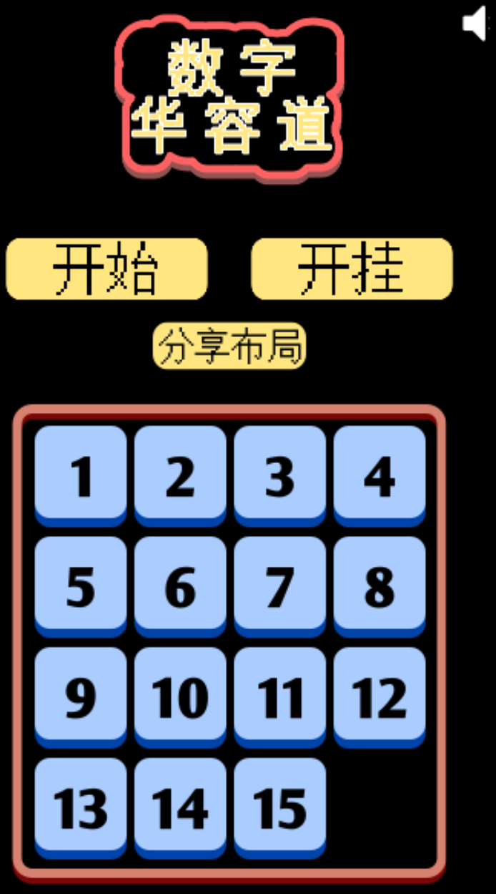

sliding_puzzle
==============

## 部署说明

当前汉化仅适用于 版本：

首先感谢原作者的开源。[原项目地址](https://github.com/gamedolphin/sliding_puzzle)

具体汉化了那些内容，请参考[翻译说明](./翻译说明.md)。

我看不懂代码，所以只做汉化，有问题，请到原作者仓库处反馈。

本人提供这个项目在 NAS、服务器等的有偿远程部署服务，有需要可联系。  
微信号 `E-0_0-`  
闲鱼搜索用户 `明月人间`  
或者邮箱 `firfe163@163.com`  
如果这个项目有帮到你。欢迎start。

有其他的项目的汉化需求，欢迎提issue。或其他方式联系通知。

### 镜像

从阿里云或华为云镜像仓库拉取镜像，注意填写镜像标签，镜像仓库中没有`latest`标签

容器内部端口 3000

```bash
docker pull swr.cn-north-4.myhuaweicloud.com/firfe/sliding_puzzle:2014.05.20
```

### docker run 命令部署

```bash
docker run -d \
--name sliding_puzzle \
--network bridge \
--restart always \
--log-opt max-size=1m \
--log-opt max-file=3 \
-p 3000:3000 \
swr.cn-north-4.myhuaweicloud.com/firfe/sliding_puzzle:2014.05.20
```
### compose 文件部署 👍推荐

```yaml
#version: '3.9'
services:
  sliding_puzzle:
    container_name: sliding_puzzle
    image: swr.cn-north-4.myhuaweicloud.com/firfe/sliding_puzzle:2014.05.20
    network_mode: bridge
    restart: always
    logging:
      options:
        max-size: 1m
        max-file: '3'
    ports:
      - 3000:3000
```

## 修改说明

这里对除了汉化之外的代码修改的说明。  
增加修改部分具体见 [修改说明](./修改说明.md)。

`./README.md` 文件翻译，增加 `## 部署说明`、`## 修改说明`、`## 效果截图` 部分。

增加目录 `./图片`
新增文件 `./.dockerignore`、`./Dockerfile`、`./翻译说明.md`

## 效果截图




## 原项目README

A simple sliding blocks puzzle game. You can also create your own puzzle and then click on "Get Url" to get 
a link which will recreate the puzzle whenever someone clicks on it.   
一个简单的滑动方块拼图游戏。你也可以自定义自己的拼图，然后点击 "Get Url" 按钮生成一个链接，
任何人点击这个链接都可以还原你当前的拼图布局。

Here's a tiny commentary about the coding style. I have, in a long time, deviated from using separate screens 
and provided you with a game in its first screen. I was trying to emulate the actual hardware toy of 
the same game which is just there and does not have a Main Menu. One of the consequences of this approach  
这里有一段关于代码风格的小评论：我已经很久没有采用“多页面分离”的方式来开发了，
这次我尝试直接呈现游戏的第一个界面，而非主菜单。
我是想模仿现实中那种实体玩具——它就在那里，没有多余的菜单界面。

is a few lines (maybe more than a few) of repeated code and inefficient algorithms. 
If you go through the code of game.js file, you'll see a lot of places where you may go "WHY!?" and in certain cases, 
I've genuinely forgotten why,  even though the I made the whole game in less than a day.   
这种设计方式的一个后果是出现了几行（可能不止几行）重复的代码，
以及一些效率并不高的算法。
如果你阅读 game.js 文件中的代码，会有很多地方让你忍不住问：“为什么这么做！？”
而在某些情况下，我自己甚至也已经忘记了当初这么写的理由了，
尽管整个游戏是我不到一天的时间内完成的。

So please forgive the crass coding and try and enjoy the game!

所以，请原谅这些粗糙的代码，尽量享受这个游戏吧！
